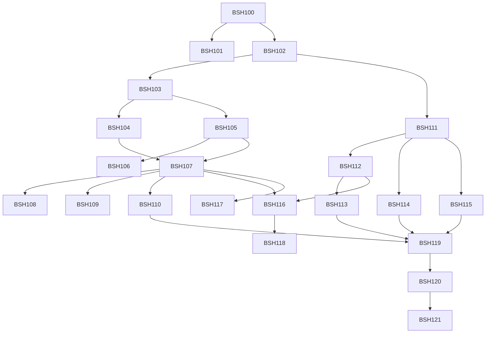

# Dependency DAG

```mermaid
graph TD
  BSH100 --> BSH101
  BSH100 --> BSH102

  BSH102 --> BSH103
  BSH103 --> BSH104
  BSH103 --> BSH105
  BSH105 --> BSH106

  BSH104 --> BSH107
  BSH105 --> BSH107
  BSH107 --> BSH108
  BSH107 --> BSH109
  BSH107 --> BSH110

  BSH102 --> BSH111
  BSH111 --> BSH112
  BSH112 --> BSH113
  BSH111 --> BSH114
  BSH111 --> BSH115

  BSH107 --> BSH116
  BSH112 --> BSH116
  BSH107 --> BSH117
  BSH116 --> BSH118

  BSH110 --> BSH119
  BSH113 --> BSH119
  BSH114 --> BSH119
  BSH115 --> BSH119

  BSH119 --> BSH120
  BSH120 --> BSH121
```

## Critical path
`BSH-100 -> BSH-102 -> BSH-103 -> BSH-105 -> BSH-107 -> BSH-110 -> BSH-119 -> BSH-120 -> BSH-121`
