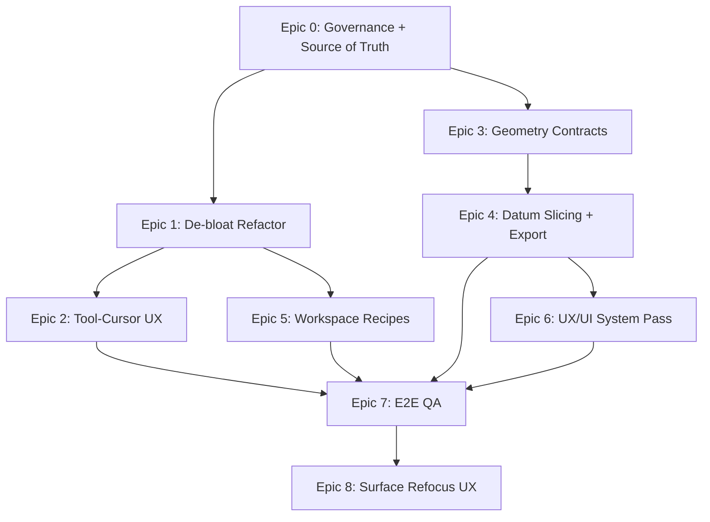

# Dependency DAG

## Epic-level DAG

## Critical Path

1. STB-001 -> STB-002 -> STB-003
2. STB-010 -> STB-011 -> STB-012 -> STB-020 -> STB-022 -> STB-023
3. STB-030 -> STB-031 -> STB-032 -> STB-033 -> STB-040 -> STB-041 -> STB-042 -> STB-044
4. STB-050 -> STB-051 -> STB-053
5. STB-070 -> STB-071 -> STB-072 -> STB-073
6. STB-073 -> STB-074
7. STB-074 -> STB-080 -> STB-081 -> STB-082 -> STB-083 -> STB-084
8. STB-081 -> STB-086 -> STB-087 -> STB-088
9. STB-082 -> STB-085 -> STB-089
